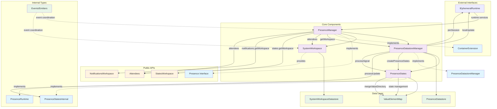

# Architecture

## Base components excluding State objects

```mermaid
graph TD
    subgraph "External Interfaces"
        Runtime[IEphemeralRuntime]
        ContExt[ContainerExtension]
    end

    subgraph "Core Components"
        PM[PresenceManager]
        PDM[PresenceDatastoreManager]
        SW[SystemWorkspace]
        PS[PresenceStates]
    end

    subgraph "Data Layer"
        PDS[PresenceDatastore]
        VEM[ValueElementMap]
        SWD[SystemWorkspaceDatastore]
    end

    subgraph "Public APIs"
        Presence[Presence Interface]
        StatesWS[StatesWorkspace]
        NotifWS[NotificationsWorkspace]
        Attendees[Attendees]
    end

    subgraph "Internal Types"
        PSI[PresenceStatesInternal]
        PR[PresenceRuntime]
        Events[Events/Emitters]
    end

    %% Main composition relationships
    PM --> PDM
    PM --> SW
    PDM --> PS
    PDM --> PDS
    PS --> VEM
    SW --> SWD

    %% Interface implementations
    PM -.->|implements| Presence
    PM -.->|implements| ContExt
    PDM -.->|implements| PresenceDatastoreManager
    PS -.->|implements| PSI
    SW -.->|provides| Attendees

    %% Key interfaces and data flow
    Runtime -->|runtime services| PM
    PM -->|getWorkspace| PDM
    PDM -->|createPresenceStates| PS
    PS -->|state management| VEM
    PM -->|attendees| SW

    %% Public API exposure
    PM -->|states.getWorkspace| StatesWS
    PM -->|notifications.getWorkspace| NotifWS
    PM -->|attendees| Attendees

    %% Internal interfaces
    PS -.->|implements| PR
    PDM -->|processUpdate| PSI
    Events -.->|event coordination| PM
    Events -.->|event coordination| SW

    %% Data flow annotations
    PDM -->|localUpdate| Runtime
    PDM -->|processSignal| PS
    PDM -->|joinSession| Runtime
    PS -->|mergeValueDirectory| VEM

    classDef interface fill:#e1f5fe
    classDef component fill:#f3e5f5
    classDef data fill:#e8f5e8
    classDef api fill:#fff3e0

    class Presence,ContExt,PresenceDatastoreManager,PSI,PR interface
    class PM,PDM,SW,PS component
    class PDS,VEM,SWD,Events data
    class StatesWS,NotifWS,Attendees api
```
